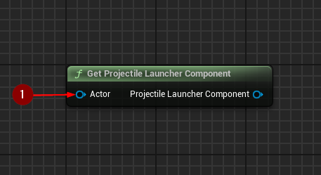
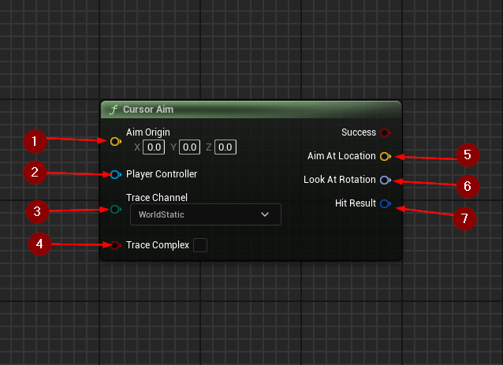
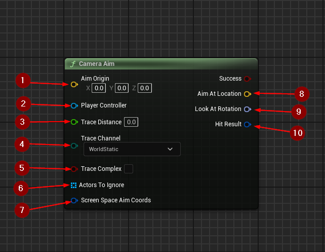
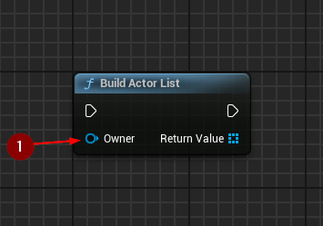
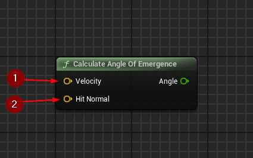
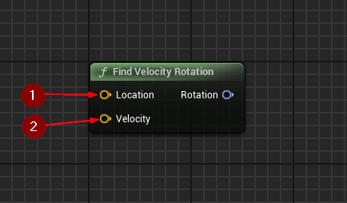
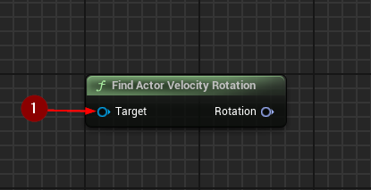

import {Step, Highlight} from '@site/src/lib/utils.mdx'

## Get Projectile Launcher Component

`Get Projectile Launcher Component` gets the VELESA Projectile Launcher component
from an actor.
* `Actor` <Step text="1"/> : The actor from which to get the component.

Returns `Projectile Launcher Component` or null if not found.

## Cursor Aim

`Cursor Aim` performs a trace collision query under the mouse cursor to detect
where the player is aiming at.
In case of a detected hit, also calculates the rotation needed to look at the
impact point from the given origin.

* `Aim Origin` <Step text="1"/> : The location to aim from.
* `Player Controller` <Step text="2"/> : Player controller that controls
the cursor.
* `Trace Channel` <Step text="3"/> : Collision channel to use for the trace.
* `Trace Complex` <Step text="4"/> : True to test against complex collision,
false to test against simplified collision.

If the trace was successful, returns `Aim at Location` <Step text="5"/>
the location of the impact point under the cursor,
`Look at Rotation` <Step text="6"/> the rotation needed to look at the impact
point of a detected object the cursor is aiming at and
`Hit Result` <Step text="7"/> the hit result of the line trace.

## Camera Aim

`Camera Aim` calculates the location and rotation of where the player controller
is aiming at. The aim point is the center of the screen, but it can be any
offset if needed.

* `Aim Origin` <Step text="1"/> : The location to aim from.
* `Player Controller` <Step text="2"/> : Player controller that controls
the camera.
* `Trace Distance` <Step text="3"/> : The distance to trace from the screen
position into the world.
* `Trace Channel` <Step text="4"/> : The collision channel to use for the trace.
* `Trace Complex` <Step text="5"/> : True to test against complex collision,
false to test against simplified collision.
* `Actors to Ignore` <Step text="6"/> : The list of actors to ignore during
the trace.
* `Screen Space Aim Coords` <Step text="7"/> : The screen-space coordinates
(0-1) for the trace starting point.

If the trace was successful, returns `Aim at Location` <Step text="8"/>
the location the camera is aiming at, `Look at Rotation` <Step text="9"/>
the rotation needed to look at the impact point of a detected object the camera
is aiming at and `Hit Result` <Step text="10"/> the hit result of the line trace.

## Build Actor List

`Build Actor List` builds a list of all actors attached to the given owner and
its instigator. The owner and instigator will be included in this list.

* `Owner` <Step text="1"/> : The owner from which to get all actors.

## Calculate Angle of Emergence

`Calculate Angle of Emergence` calculates the angle of emergence (exit) in
radians, representing the alignment of the velocity direction with the hit
normal.

* `Velocity` <Step text="1"/> : Input velocity vector.
* `Hit Normal` <Step text="2"/> : Input hit normal vector.

## Find Velocity Rotation

`Find Velocity Rotation` finds worlds-space rotation from objects location and
velocity.

* `Location` <Step text="1"/> : The starting location for the rotation
calculation.
* `Velocity` <Step text="2"/> : The velocity vector indicating the direction to
look towards.

## Find Actor Velocity Rotation

`Find Actor Velocity Rotation` finds world-space absolute rotation of an actor
based on its velocity XYZ.

* `Target` <Step text="1"/> : The target actor used for the rotation calculation.

