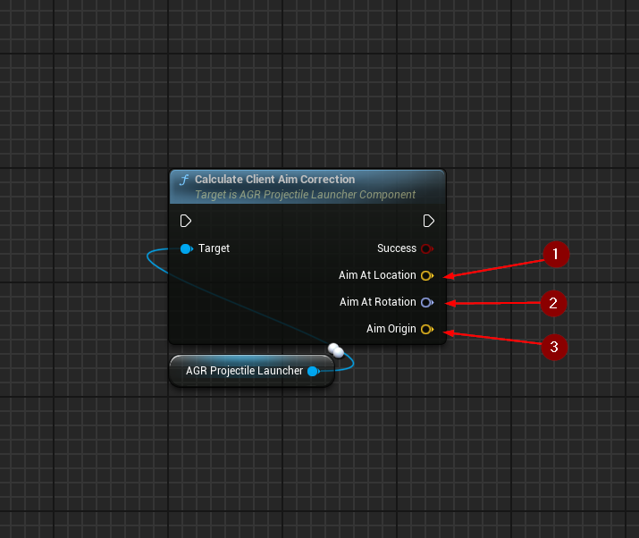
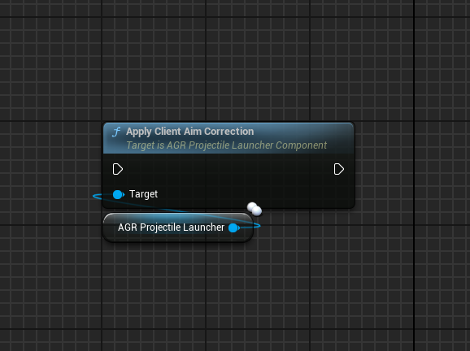
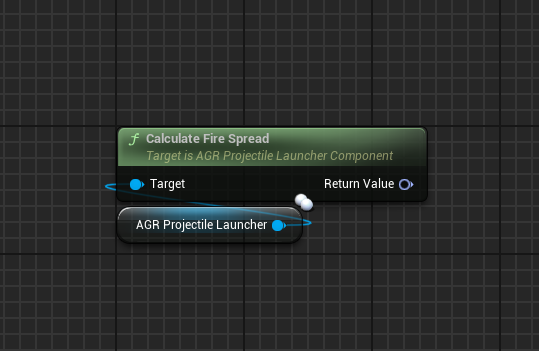

import {Step} from '@site/src/lib/utils.mdx'

## Calculate Client Aim Correction

`Calculate Client Aim Correction` calculates the client aim correction for
the owning local player controller.

If the calculation was successful `Aim At Location` <Step text="1"/> will
contain the location the camera is aiming at,
`Aim At Rotation` <Step text="2"/> will contain the rotation needed to look at
the impact point of a detected object the camera is aiming at and
`Aim Origin` <Step text="3"/> will contain the location the aim started from.

## Apply Client Aim Correction

`Apply Client Aim Correction` calculates the client's camera aim origin and
rotation and sends it to the server.

The aim correction is only applied under the following conditions:
- `bClientAimCorrectionEnabled` is set to true.
- The function is executed on a locally controlled client.
- The weapon can fire.

## Calculate Fire Spread

`Calculate Fire Spread` calculates the spread that will be used when spawning
projectiles. The default implementation uses the `FireSpread` variable with
randomness to achieve a random spread on each axis.

Override this function for custom calculation logic.

