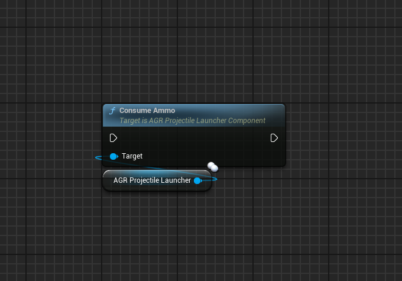
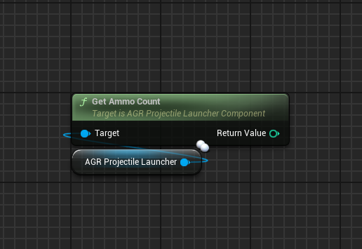
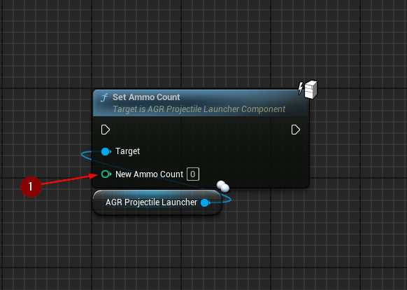
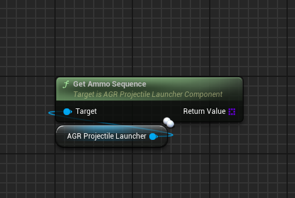
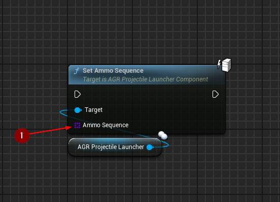
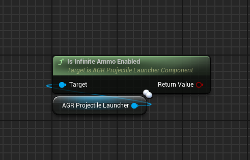
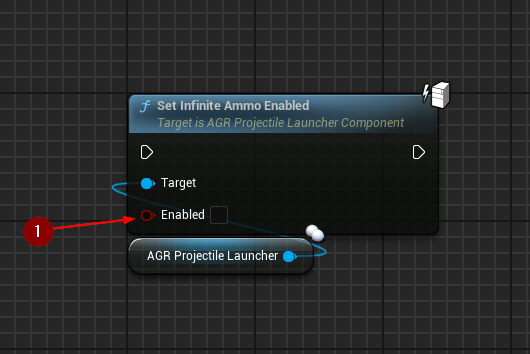

import {Step} from '@site/src/lib/utils.mdx'

## Consume Ammo

`Consume Ammo` reduces `AmmoCount` by `AmmoConsumptionPerShot` but only if
`bInfiniteAmmoEnabled` is set to false.

:::note
This function does not prevent the `AmmoCount` to become a negative value.
:::

## Get Ammo Count

`Get Ammo Count` gets current ammo count.

## Set Ammo Count

`Set Ammo Count` sets a new ammo count.
* `New Ammo Count` <Step text="1"/> : New amount of ammo.

:::note
This function should only be called with authority.
:::

## Get Ammo Sequence

`Get Ammo Sequence` gets ammo sequence set in the projectile launcher.

## Set Ammo Sequence

`Set Ammo Sequence` sets a new ammo sequence and resets the `AmmoSequenceIndex`.

Calls the [OnAmmoSequenceUpdated](/docs/projectile-module/projectile-launcher-component/overview#on-ammo-sequence-updated)
event dispatcher when a new ammo sequence was
set.
* `Ammo Sequence` <Step text="1"/> : The new ammo sequence.

:::note
This function should only be called with authority.
:::

## Is Infinite Ammo Enabled

`Is Infinite Ammo Enabled` checks is infinite ammo enabled.

## Set Infinite Ammo Enabled

`Set Infinite Ammo Enabled` sets is infinite ammo should be enabled.
If infinite ammo is enabled it will make the Projectile Launcher completely skip
ammo consumption logic.
See: [CanFire()](/docs/projectile-module/projectile-launcher-component/functions/weapon#can-fire),
[ConsumeAmmo()](/docs/projectile-module/projectile-launcher-component/functions/ammo#consume-ammo).
* `Enabled` <Step text="1"/> : If true, ammo will be infinite.

:::note
This function should only be called with authority.
:::
