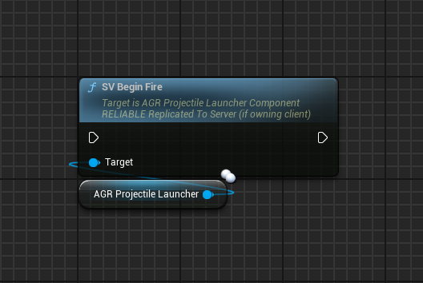
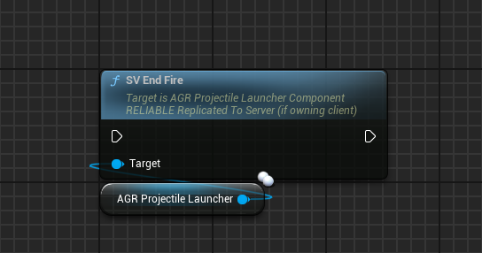
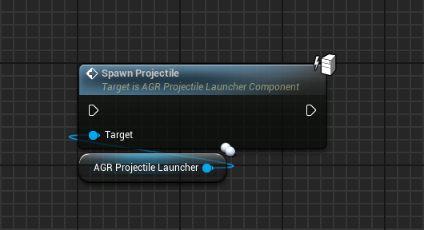
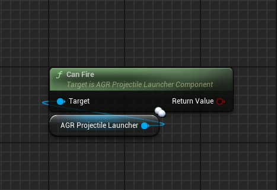
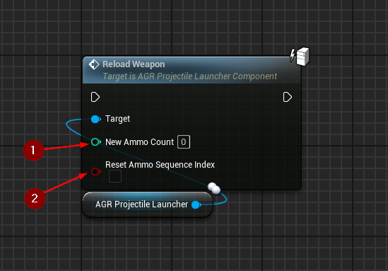
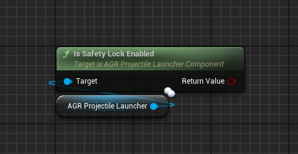
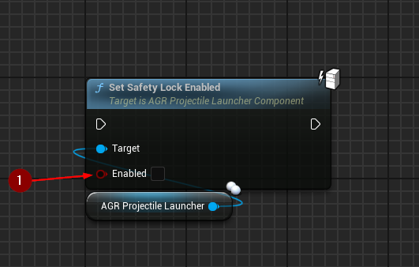
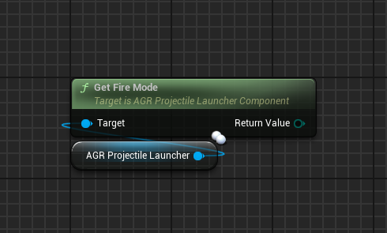
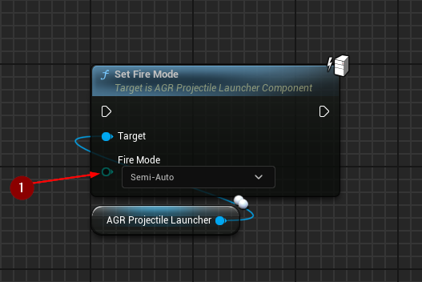

import {Step} from '@site/src/lib/utils.mdx'

## Begin Fire

When `SV Begin Fire` is called on an owning client, this will invoke an RPC on
the server.

The server will run checks whether the weapon can be currently fired and if so
it will perform firing the weapon according to the selected [fire mode](/docs/projectile-module/types#fire-mode).

:::note
The function is only executed on the server.
:::

## End Fire

When `SV End Fire` is called on an owning client, this will invoke an RPC on
the server.

The server will end firing the weapon according to the selected [fire mode](/docs/projectile-module/types#fire-mode).

Calls the [OnBurstInterrupted](/docs/projectile-module/projectile-launcher-component/overview#on-burst-interrupted)
event dispatcher when a burst fire action was interrupted.
Calls the [OnBurstFinished](/docs/projectile-module/projectile-launcher-component/overview#on-burst-finished)
event dispatcher when a burst fire action is finished.

:::note
The function is only executed on the server.
:::

## Spawn Projectile

`Spawn Projectile` spawns a new projectile actor using the class that is returned
from `GetProjectileClass()`.

The projectile's spawn location and rotation will be determined by
`GetSafeProjectileSpawnLocation()` and [CalculateFireSpread()](/docs/projectile-module/projectile-launcher-component/functions/aiming#calculate-fire-spread)
respectively.

Calls the [OnProjectileSpawned](/docs/projectile-module/projectile-launcher-component/overview#on-projectile-spawned)
event dispatcher after successfully spawning the projectile.

:::note
This function should only be called with authority.
:::

## Can Fire

`Can Fire` checks if the weapon can fire in two steps:
1. Safety Lock needs to be disabled and a non-empty ammo sequence must be defined.
(See: `bSafetyLockEnabled` and `AmmoSequence`)
2. Is there enough available ammo to consume?
(See: `AmmoCount` and `AmmoConsumptionPerShot`)

Exception for step 2: If `bInfiniteAmmoEnabled` is set to true, the check for
enough ammo will be skipped.

True if the weapon can fire. Otherwise, false.

## Reload Weapon

`Reload Weapon` reloads the weapon by setting a new ammo count.

Calls the [OnWeaponReloaded](/docs/projectile-module/projectile-launcher-component/overview#on-weapon-reloaded)
event dispatcher.
* `New Ammo Count` <Step text="1"/> : New amount of ammo.
* `Reset Ammo Sequence Index` <Step text="2"/> : If true, `AmmoSequenceIndex`
will be reset.

:::note
This function should only be called with authority.
:::

## Is Safety Lock Enabled

`Is Safety Lock Enabled` checks is safety lock enabled.

## Set Safety Lock Enabled

`Set Safety Lock Enabled` sets the state of the safety lock of
the projectile launcher.
* `Enabled` <Step text="1"/> : If true, the projectile launcher can fire.
Otherwise, firing is prevented.

:::note
This function should only be called with authority.
:::

## Get Fire Mode

`Get Fire Mode` gets the [fire mode](/docs/projectile-module/types#fire-mode)
of the projectile launcher.

## Set Fire Mode

`Set Fire Mode` sets the fire mode of the projectile launcher.
* `Fire Mode` <Step text="1"/> : The new [fire mode](/docs/projectile-module/types#fire-mode).

:::note
This function should only be called with authority.
:::