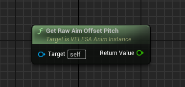
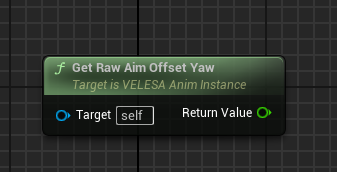
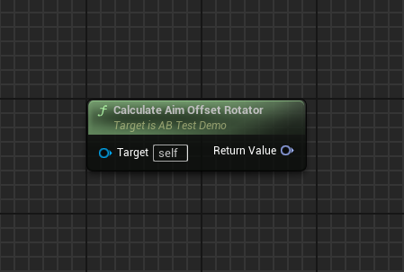
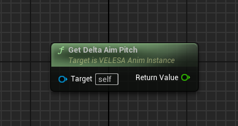
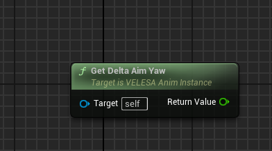
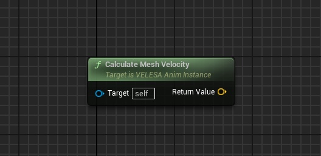
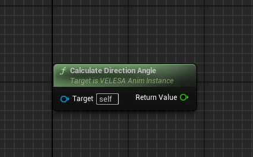
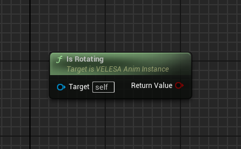
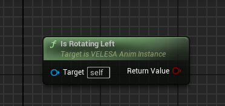
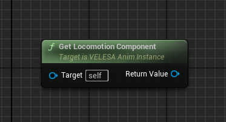

 
## Get Raw Aim Offset Pitch

`Get Raw Aim Offset Pitch` gets the controller's pitch that takes network
replication into account. Value is internally calculated by unwinding the
rotation to its "shortest route" rotation.

## Get Raw Aim Offset Yaw

`Get Raw Aim Offset Yaw` gets the controller's yaw that takes network
replication into account.

## Calculate Aim Offset Rotator

`Calculate Aim Offset Rotator` calculates rotation from aim offset.
Useful for IK.

## Get Delta Aim Pitch

`Get Delta Aim Pitch` calculates the remaining aim pitch until reaching target
value.

## Get Delta Aim Yaw

`Get Delta Aim Yaw` calculates the remaining aim yaw until reaching target value.

## Calculate Mesh Velocity

`Calculate Mesh Velocity` calculates the velocity in relation to the skeletal
mesh's root bone orientation.

## Calculate Direction Angle

`Calculate Direction Angle` calculates angle for movement direction relative to
the mesh's root bone rotation.

## Is Rotating

`Is Rotating` checks whether skeletal mesh is rotating.

Returns true, if skeletal mesh is rotating. Otherwise, false.

## Is Rotating Left

`Is Rotating Left` checks if pawn is leaning to the left side.

Returns true, if leaning left. Otherwise, false.

## Get Locomotion Component

`Get Locomotion Component` gets `Locomotion Component`.

