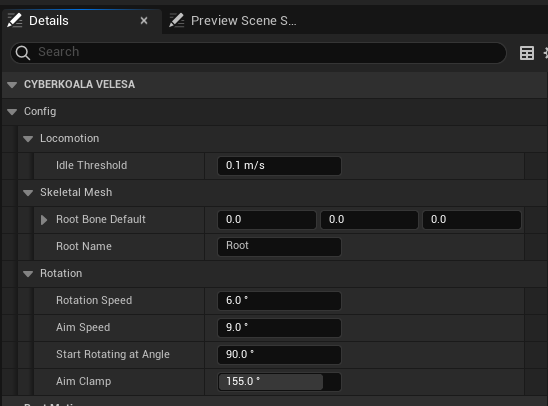

 
The ` VELESA Anim Instance` using ` VELESA Locomotion Component`.

## Anim Instance Settings Config

### Locomotion
* `Idle Threshold` : Defines the maximum threshold for the actor's speed that
will still be handled as being idle.

### Skeletal Mesh
* `Root Bone Default` : Default rotation of the skeletal mesh's root bone.
* `Root Name` : Name of the skeletal mesh's root bone.

### Rotation
* `Rotation Speed` : Speed of interpolation of the rotation.
Set to 0 to disable interpolation.
* `Aim Speed` : Speed of interpolation of the aim offset.
Set to 0 to disable interpolation.
* `Start Rotating at Angle` : The character will start to turn-in-place if
the horizontal aim offset goes beyond this angle.
* `Aim Clamp` : Limits horizontal aim offset.

## Anim Instance Runtime Variables

### Speed
* `Forward Speed` : Forward speed of the pawn (X-axis).
* `Strafe Speed` : Strafe speed of the pawn (Y-axis).
* `Fall Speed` : Falling speed of the pawn (Z-axis).
* `Movement Speed` : Movement speed of the pawn.
* `Movement Speed XY` : Movement speed of the pawn limited to the XY-plane.

### Movement
* `Idle XY` : True, if pawn has no planar movement according to `IdleThreshold`.
Falling (Z-axis) is ignored.
* `Idle` : True, if pawn has no movement in any direction according to
`IdleThreshold`.
* `Crouching` : True, if pawn is crouching.
* `Swimming` : True, if pawn is swimming.
* `In Air` : True, if pawn is either flying or falling.
* `Falling` : True, if pawn is falling.
* `Flying` : True, if pawn is flying.
* `Moving on Ground` : True, if pawn is moving on ground.
* `Normalized Movement Direction` : Normalized movement direction of the pawn.

### Rotation
* `Aim Offset Pitch` : Current pitch of the aim offset.
* `Aim Offset Yaw` : Current yaw of the aim offset.
* `Relative Root Rotation` :  World-space rotation between the skeletal mesh and
pawn root component.
* `Direction Angle` : The direction angle that describes the movement direction
relative to the skeletal mesh's root bone rotation.
* `Lean` : Amount of leaning into either direction.