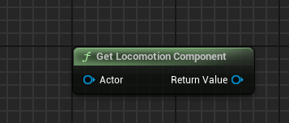

 

## Get Locomotion Component

`Get Locomotion Component` retrieves the ` VELESA Locomotion Component` from
the actor or its instigator.
* `Actor`  : Target for retrieval.

Returns the found component, or nullptr.