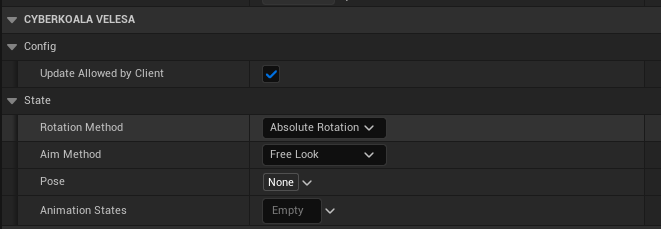
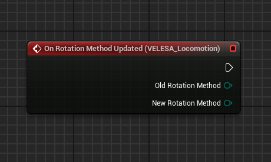
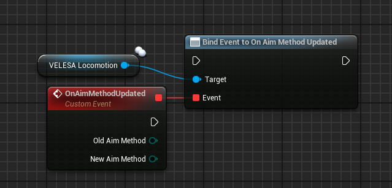
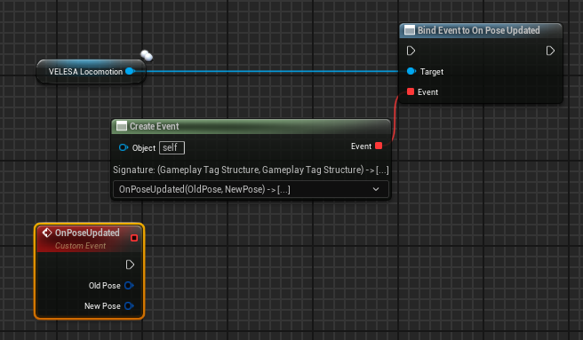
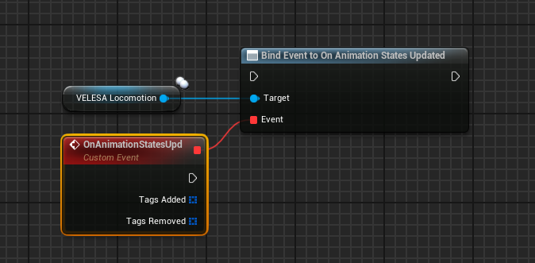

 
The ` VELESA Locomotion Component` is responsible for multiplayer management of aim
offset, rotation methods and animation pose state updates. It works in tandem
with the ` VELESA Anim Instance`.

## Locomotion Component Settings

### Config
* `Update Allowed by Client` : If false, all changes to animation poses done by
the client will only be local and never replicated.

:::note
This value cannot be changed at run-time.
:::

### State
* `Rotation Method` : Controls how the actor is [rotated](/docs/animation-module/types#rotation-method).
* `Aim Method` : Controls how the actor is [aiming](/docs/animation-module/types#aim-method).
* `Pose` : Current pose represented by a tag.
* `Animation States` : Gameplay tag container that is used to store animation
states.

## Events

### On Rotation Method Updated

`On Rotation Method Updated` event will be called when the `Rotation Method` of
the component changes.

* `Old Rotation Method`  : Old actors [rotation method](/docs/animation-module/types#rotation-method).
* `New Rotation Method`  : New actors [rotation method](/docs/animation-module/types#rotation-method).

### On Aim Method Updated

`On Aim Method Updated` event will be called when the `Aim Method` of the component
changes.

* `Old Aim Method` : Old actors [aim method](/docs/animation-module/types#aim-method).
* `New Aim Method`  : New actors [aim method](/docs/animation-module/types#aim-method).

### On Pose Updated

`On Pose Updated` event will be called when the `Pose` of the component changes.

* `Old Pose`  : Old actors pose represented by a tag.
* `New Pose` : New actors pose represented by a tag.

### On Animation States Updated

`On Animation States Updated` event will be called when the `AnimationStates` of
the component changes.

* `Tags Added`  : The array of tags added to `AnimationStates`
tag container.
* `Tags Removed`  : The array of tags removed from
`AnimationStates` tag container.

