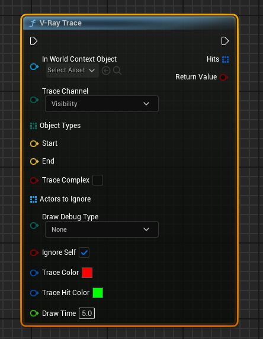

import {Step, Highlight} from '@site/src/lib/utils.mdx'

## V-Ray Trace

`V-Ray Trace` does a collision trace along the given line and returns all hits
encountered.
This only finds objects that are of a type specified by `ObjectTypes` and will
be filtered by `TraceChannel` and will return only blocking collision response.

* `World Context Object`  : World context.
* `Trace Channel`  : The channel to trace.
* `Object Types`   : Array of Object Types to trace. If left
empty, all object types will be selected.
* `Start` : Start of line segment.
* `End`  : End of line segment.
* `Trace Complex`   : True to test against complex collision,
false to test against simplified collision.
* `Actors to Ignore`  : Array of actors that will be ignored
during the line trace.
* `Draw Debug Type`   : Draw debug trace type.
* `Ignore Self`   : True to ignore self actor.
* `Trace Color`  : Trace color.
* `Trace Hit Color`   : Trace hit color.
* `Draw Time`   : Draw time when type is not none.

Returns properties of the trace hit and true  
if there was a blocking hit, false otherwise.