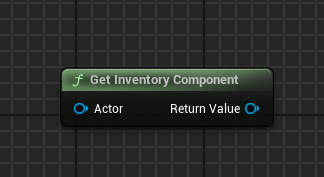
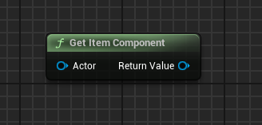
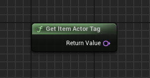

import {Step, Highlight} from '@site/src/lib/utils.mdx'

## Get Inventory Component

`Get Inventory Component` gets the `VELESA Inventory component` from an actor.
* `Actor` <Step text="1"/> : The actor from which to get the component.

Returns inventory component or null if not found.

## Get Item Component

`Get Item Component` gets the `VELESA Item Component` from an actor.
* `Actor` <Step text="1"/> : The actor from which to get the component.

Returns item component or null if not found.

## Get Item Actor Tag

`Get Item Actor Tag` gets the item actor tag name that is configured in this
plugin's project settings.

