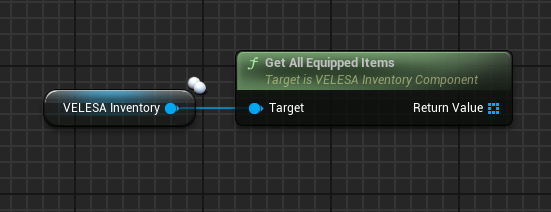
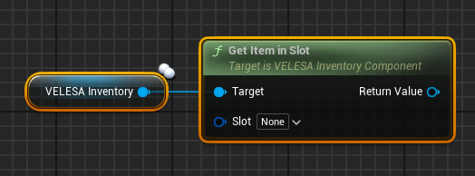
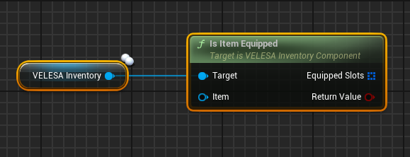

import {Step} from '@site/src/lib/utils.mdx'

## Get All Equipped Items

`Get All Equipped Items` gets all equipped items in this inventory.

## Get Item in Slot

`Get Item in Slot` gets the item equipped in the given slot if available.
* `Slot`: The slot from which to potentially get an equipped item.

Returns item equipped in slot if found. Otherwise, null.

## Is Item Equipped

`Is Item Equipped` checks if this item is equipped in this inventory in one or more slots.
* `Item` : Item to check for being equipped.

If item is equipped, value `Equipment Slots` will hold slots in which this item was found equipped.