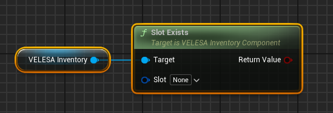
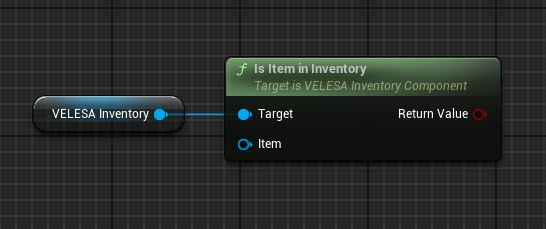
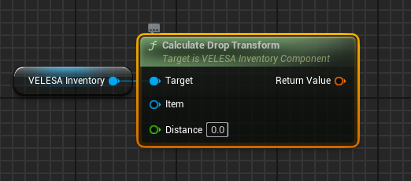
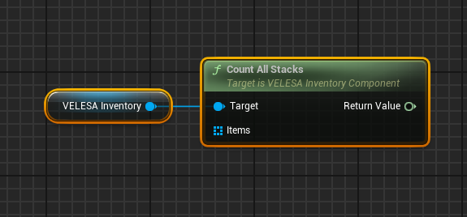
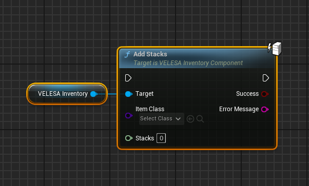
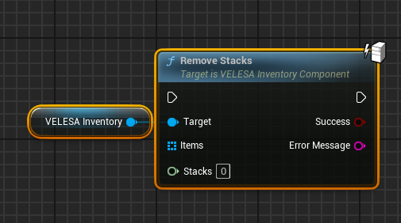

 

 

## Slot Exists

`Slot Exists` checks is the specified slot exists.
* `Slot` : Slot to check if it exists.

Returns true if slot exists, otherwise false.

## Is Item in Inventory

`Is Item in Inventory` checks if the specified item is in this inventory.
* `Item` : Item to check for if it is in this inventory.

Returns true if item is in this inventory. Otherwise, false.

## Calculate Drop Transform

`Calculate Drop Transform` calculates a transform for where to drop the item from this inventory.
* `Item` : Item to drop.
* `Distance`  : The distance from the instigator that the item will be dropped to.

Returns transform for where to drop the item.

## Count All Stacks

`Count All Stacks` counts total number of specified items in the inventory.
* `Items`  : Items of which to count total amount of stacks for.

Returns total amount stacks for the specified items in the inventory.

## Add Stacks

`Add Stacks` adds new stacks to this inventory of specified item class.
* `Item Class`   : Class of the items to add.
* `Stacks`  : Amount of items to add.

:::note
This function should only be called with authority.
:::

## Remove Stacks

`Remove Stacks` remove specified number of stacked items from this inventory.
* `Items`  : Arrays of items from which to remove.
* `Stacks`  : Number of items to remove from stacks.

:::note
This function should only be called with authority.
:::