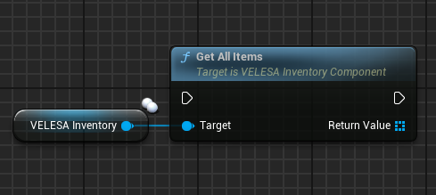
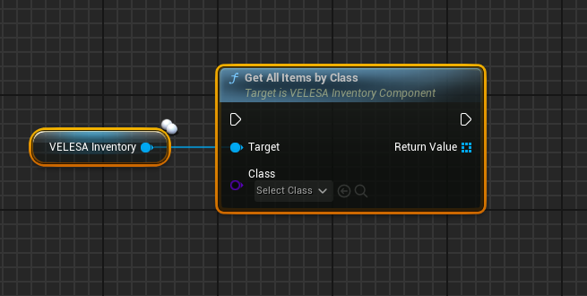
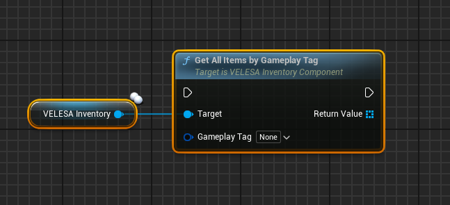
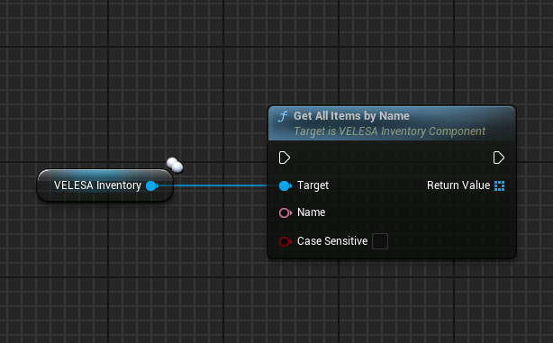
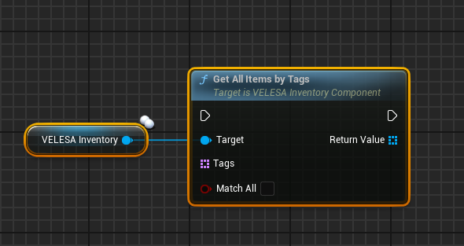

import {Step} from '@site/src/lib/utils.mdx'

## Get All Items

`Get All Items` gets all items in this inventory.

Returns an array of all items in this inventory.

## Get All Items by Class

`Get All Items by Class` gets all items filtered by class in this inventory.
* `Class` : Class of the items to filter by.

Returns all items in this inventory of the specified class.

## Get All Items by Gameplay Tag

`Get All Items by Gameplay Tag` gets all items filtered by gameplay tag in this inventory.
* `Gameplay Tag` : Gameplay tag of the items to filter by.

Returns all items filtered by gameplay tag in this inventory.

## Get All Items by Name

`Get All Items by Name` gets all items filtered by name in this inventory.
* `Name`: Name of the items to filter by.
* `Case Sensetive` : If true, the text comparison of names will be case-sensitive.

Returns all items filtered by name in this inventory.

## Get All Items by Tags

`Get All Items by Tags` gets all items filtered by tags in this inventory.
* `Tags`: Tags of the items to filter by.
* `Match All`  : If true will return only items that match all of the specified tags.

Returns all items filtered by tags in this inventory.