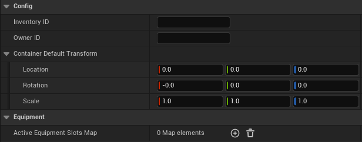
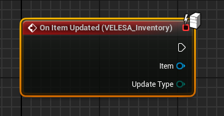
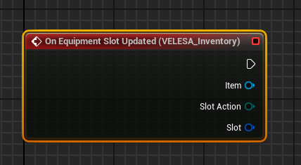

 

The `VELESA Inventory Component` is a flexible and fully network-replicated inventory
solution that works in tandem with the `VELESA Item Component`.
Every inventory component makes use of an internal inventory container object
to manage items.

## Inventory Component Settings

### Config
* `Inventory ID` : The ID of this inventory.
* `Owner ID` : The ID of the owner this inventory belongs to.
* `Container Default Transform` : The default transform where the inventory
container will be automatically spawned on begin play.

### Equipment
* `Active Equipment Slots Map` : Maps equipment slots to currently equipped items.

## Events
### On Item Updated

:::tip
Keep in mind that those events will be called only on the server, so there is
no need for checking authority nor using RPCs.
:::

`On Item Updated` event will be called when the item was updated.
* `Item`  : Item that was updated.
* `Update Type` : [Type of the update](/docs/inventory-module/types#item-update-type) that happened.

### On Equipment Slot Updated

`On Equipment Slot Updated` event will be called when the equipment slot was updated.
* `Item` : Item in equipment slot that was updated.
* `Slot Action`  : [Type of the action](/docs/inventory-module/types#equipment-slot-action) that happened.
* `Slot`: Equipment slot that was updated.

