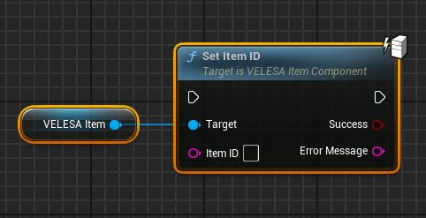
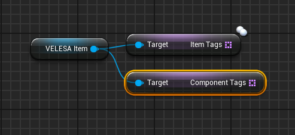

 

## Set Item ID

`Set Item ID` sets new ID for this item.
* `Set Item ID` : New item ID.

:::note
This function should only be called with authority.
:::

## Get Item Tags

`Get Item Tags` gets the item / component tag names 

