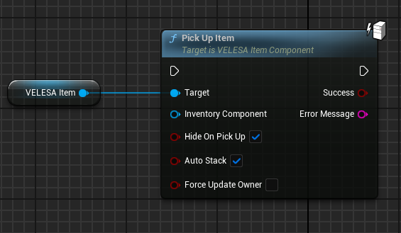
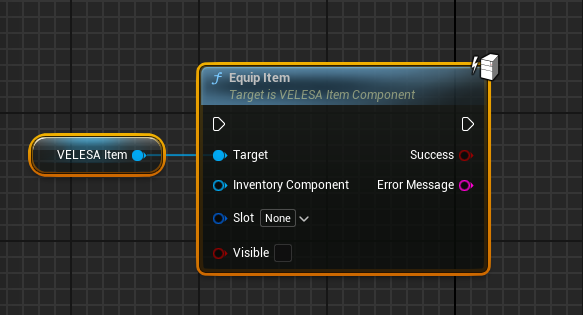
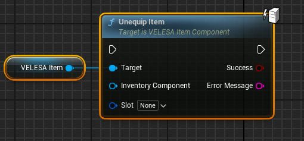
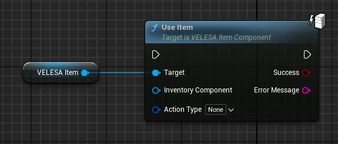
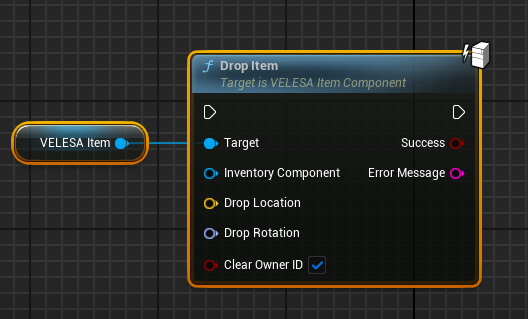
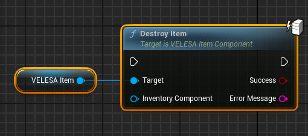

 

:::note
All of the item action functions should only be called with authority.
:::

## Pick Up Item

`Pick Up Item` picks up this item.
*  `Inventory Component`  : Inventory component of an actor that
picks up this item.
* `Hide on Pick Up`  : If true this item will become invisible
after picked up.
* `Auto Stack`  : If true will try to stack this item with other
already existing instances of this item in the actors inventory.
* `Force Update Owner` : If true will overwrite items owner ID to
inventories ID.

## Equip Item

`Equip Item` equips this item.
* `Inventory Component`   : Inventory component of an actor that
equips this item.
* `Slot`  : Slot into which one to equip the item.
* `Visible : If true will make item visible.

## Unequip Item

`Unequip Item` unequips this item.
* `Inventory Component`  : Inventory component of an actor that
unequips this item.
* `Slot`  : Slot from which one to unequip the item.

## Use Item

`Use Item` uses this item.
* `Inventory Component`   : Inventory component of an actor that
uses this item.
* `Action Type`  : Type of action to call on this item.

## Drop Item

`Drop Item` drops this item.
* `Inventory Component`  : Inventory component of an actor that
drops this item.
* `Drop Location`  : Items location after it is dropped.
* `Drop Rotation` : Items rotation after it is dropped.
* `Clear Owner` : If true clear items owner ID.

## Destroy Item

`Destroy Item` destroys this item.
* `Inventory Component` : Inventory component of an actor that
destroys this item.

