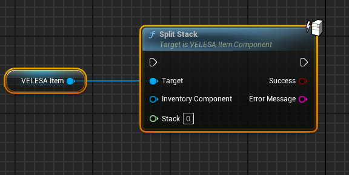
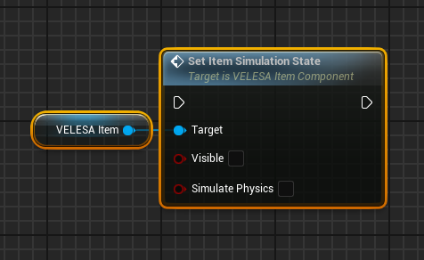

 

## Split Stack

`Split Stack` splits this item stack into two stacks with one of them containing
the specified amount of items and the second one with the rest of them.
This will update this item and also create a new one and automatically pick it up.
* `Inventory Component`  : Inventory component of an actor that
splits the item.
* `Stack`   : Amount of items to have in a new stack.
Cannot be less than this item has items in its stack.

:::note
This function should only be called with authority.
:::

## Set Item Simulation State

`Set Item Simulation State` Sets this item's visibility and state of
simulating physics. State of simulating physics will be changed only if the
set root component is a subclass of primitive component. Collisions will be
disabled while the item is invisible and re-enabled when
turned back on to be visible.
* `Visible` : If true item will become visible.
* `Simulate Physics`  : If true state of simulating physics will
be restored. This parameter has no effect when bVisible is set to false and
is only used when bVisible is set to true.

