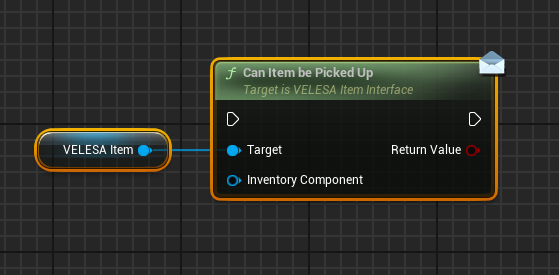
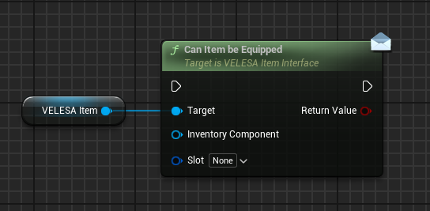
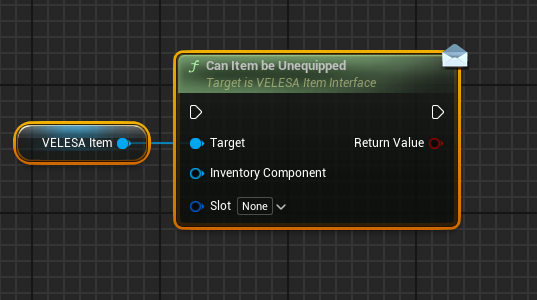
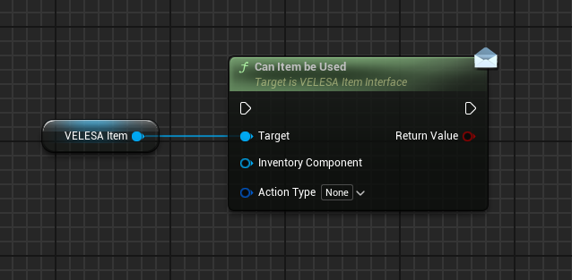
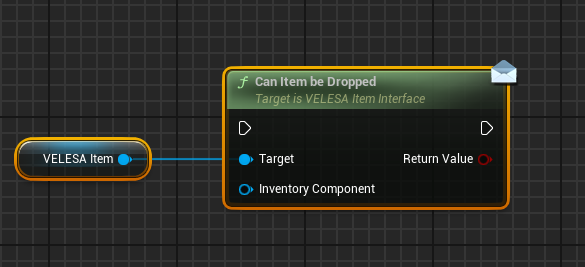
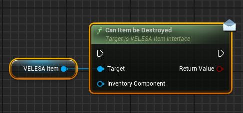

 

This interface allows to add custom logic for VELESA Items.
Simply add this interface to your actor representing an item which uses
the VELESA Item component.

## Can Item be Picked Up

`Can Item be Picked Up` checks if this item can be picked up.
* `Inventory Component`  : Inventory component of an actor that
tries to pick up this item.

## Can Item be Equipped

`Can Item be Equipped` checks if this item can be equipped.
* `Inventory Component` : Inventory component of an actor that
tries to equip this item.
* `Slot` : Slot into which the item will be equipped.

## Can Item be Unequipped

`Can Item be Unequipped` checks if this item can be unequipped.
* `Inventory Component` : Inventory component of an actor that
tries to unequip this item.
* `Slot` : Slot from which the item will be unequipped.

## Can Item be Used

`Can Item be Used` checks if this item can be used.
* `Inventory Component` : Inventory component of an actor that
tries to use this item.
* `Action Type`: Type of action how the item will be used.

## Can Item be Dropped

`Can Item be Dropped` checks if this item can be dropped.
* `Inventory Component`: Inventory component of an actor that
tries to drop this item.

## Can Item be Destroyed

`Can Item be Destroyed` checks if this item can be destroyed.
* `Inventory Component`  : Inventory component of an actor that
tries to destroy this item.

