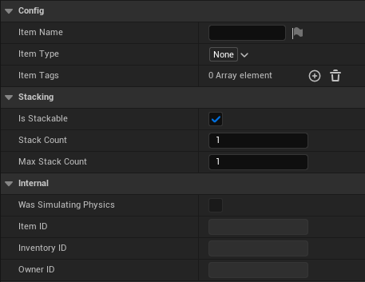
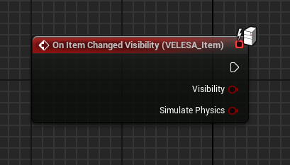
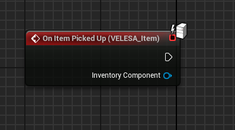
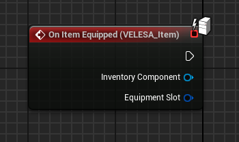
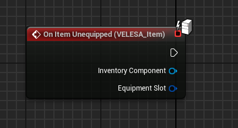
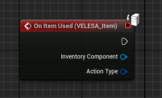
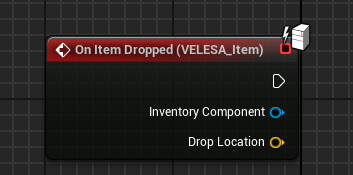
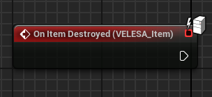

 

The `VELESA Item Component` allows to turn any actor into an item that works in
single and multiplayer scenarios.

VELESA Items come with the following features:
* Pick up item
* Drop item
* Use item
* Equip item
* Unequip item
* Destroy item
* Change visibility & simulate physics of item
* Stacking

## Item Component Settings

### Config
* `Item Name` : Name of this item.
* `Item Type` : Type of this item.
* `Item Tags` : Tags of this item.

### Stacking
* `Is Stackable` : Whether this item can be stacked or not.
* `Stack Count` : The current stack count contained in this item instance.
Only applicable when bIsStackable is enabled.
* `Max Stack Count` : The maximum stack count of this item type.
Only applicable when bIsStackable is enabled.

### Internal
* `Was Simulating Physics` : Internal flag to be able to restore the previous
state of simulating physics for this item.
* `Item ID` : The ID of this item.
* `Inventory ID` : The ID of the inventory this item belongs to.
* `Owner ID` : The ID of the owner this item belongs to.

## Events

:::tip
Keep in mind that those events will be called only on the server, so there is
no need for checking authority nor using RPCs.
:::

### On Item Changed Visibility

`On Item Changed Visibility` event will be called when the item visibility changed.
* `Visibility`  : If true item became visible, otherwise false.
* `Simulate Physics`  : If true item started simulating physics,
otherwise false.

### On Item Picked Up

`On Item Picked Up` event will be called when the item was picked up.
* `Inventory Component`   : Inventory component of an actor that
picked up this item.

### On Item Equipped

`On Item Equipped` event will be called when the item was equipped.
* `Inventory Component`  : Inventory component of an actor that
equipped this item.
* `Equipment Slot` : Slot into which one the item was equipped.

### On Item Unequipped

`On Item Unequipped` event will be called when the item was unequipped.
* `Inventory Component`   : Inventory component of an actor that
unequipped this item.
* `Equipment Slot`   : Slot from which one the item was unequipped.

### On Item Used

`On Item Used` event will be called when the item was used.
* `Inventory Component`  : Inventory component of an actor that
used this item.
* `Action Type` : Type of action that was called on this item.

### On Item Dropped

`On Item Dropped` event will be called when the item was dropped.
* `Inventory Component`  : Inventory component of an actor that
dropped this item.
* `Drop Location`  : Items location where it was dropped.

### On Item Destroyed

`On Item Destroyed` event will be called when the item was destroyed.

