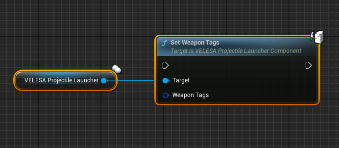
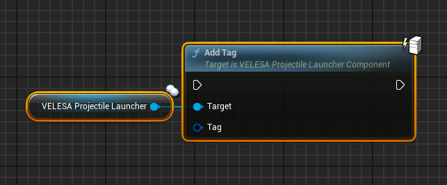
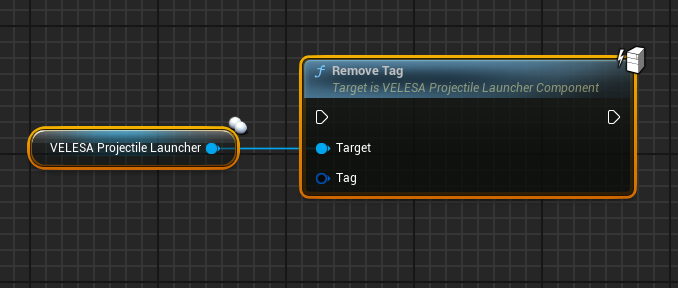

 

## Set Weapon Tags

`Set Weapon Tags` sets `WeaponTags` array.
* `Weapon Tags`  : Input array to set.

:::note
This function should only be called with authority.
:::

## Add Tag

`Add Tag` adds tag to the `WeaponTags` array.
* `Tag`  : Tag to add to the array.

:::note
This function should only be called with authority.
:::

## Remove Tag

`Remove Tag` removes tag from the `WeaponTags` array.
* `Tag`  : Tag to remove from the array.

:::note
This function should only be called with authority.
:::