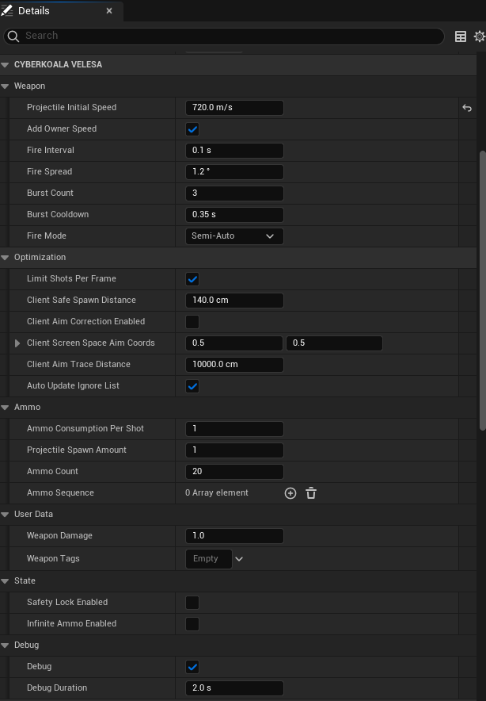
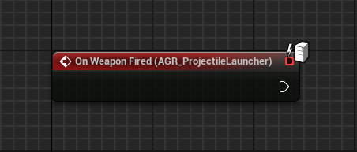
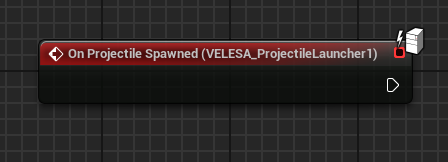
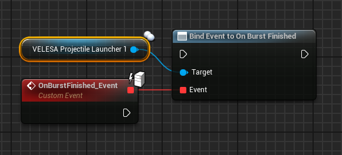
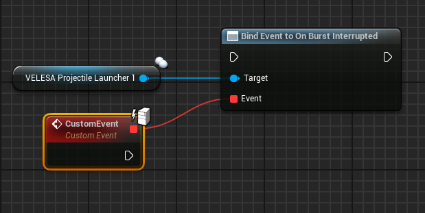
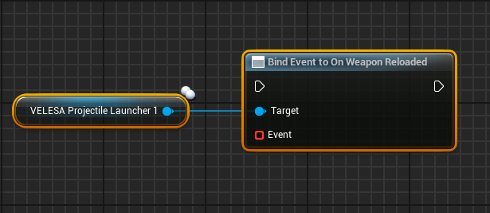
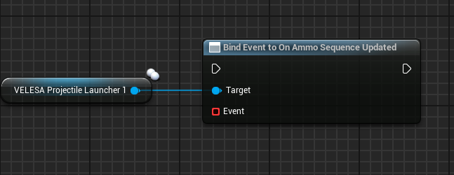
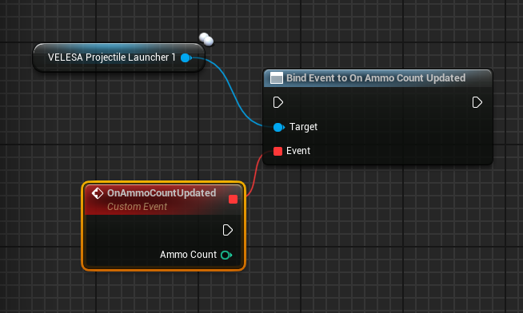
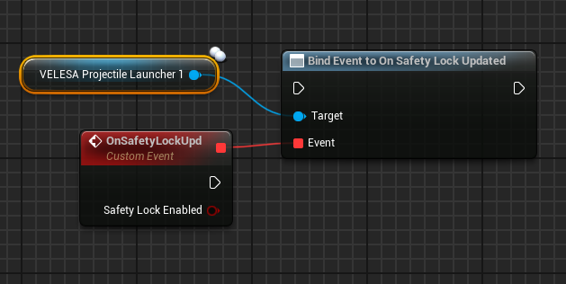
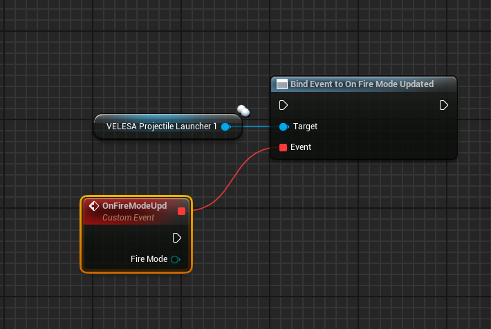

 

The `VELESA Projectile Launcher` component should be attached to an actor to become
a type of weapon.
Functions in this component fully manage firing including different fire modes
and provide a wide range of configurations for project-specific use-cases.

## Projectile Launcher Settings

### Weapon
* `Projectile Initial Speed` : The projectile's initial speed when spawned.
* `Add Owner Speed` : If true, the Projectile Launcher component's velocity
will be added to the initial speed of the projectile.
* `Fire Interval` : The interval at which the weapon can fire.
* `Fire Spread` : This value is used to calculate a randomized angle for
a new projectile. See [CalculateFireSpread()](/docs/projectile-module/projectile-launcher-component/functions/aiming#calculate-fire-spread)
for more details.
* `Burst Count` : The maximum amount of ammo that will be shot when
calling [BeginFire()](/docs/projectile-module/projectile-launcher-component/functions/weapon#begin-fire).
* `Burst Cooldown` : The delay before another burst fire can be triggered.
* `Fire Mode` : The weapon's [fire mode](/docs/projectile-module/types#fire-mode)
that defines the firing behavior.

:::note notes
`Fire Interval` = 1, this means that you are allowed to shoot 1 projectile every second.

`Burst Count` applies to the following [fire modes](/docs/projectile-module/types#fire-mode)
only:
- `Burst`
- `InterruptibleBurst`
:::

### Optimization
* `Limit Shots Per Frame` : Set this variable to true in order to avoid unwanted
collisions between multiple projectiles spawned at the same frame.
Consider this example: If the fire rate is faster than the frame rate, it is
possible that more than one projectile will be spawned at the same frame.
* `Client Safe Spawn Distance` : The maximum allowed distance between
the Projectile Launcher component's location on the server and client.
If the distance exceeds this value, the client's location will be discarded.
* `Client Aim Correction Enabled` : If true, a client will be allowed to send
its aim origin and rotation to the server.
The update will occur on tick of the component.
* `Client Screen Space Aim Coords` : The screen-space coordinates (0.0 - 1.0)
to use when calculating the client's camera aim.
This defines where the crosshair is.
* `Client Aim Trace Distance` : The distance to trace from
`ClientScreenSpaceAimCoords` into the world.
* `Auto Update Ignore List` : If set to true, `ActorsIgnoredByProjectiles`
will be updated every time [BeginFire()](/docs/projectile-module/projectile-launcher-component/functions/weapon#begin-fire)
is called.

### Ammo
* `Ammo Consumption Per Shot` : The amount of ammo to consume per shot.
* `Projectile Spawn Amount` : The amount of projectiles to spawn per shot.
* `Ammo Count` : The amount of available ammo for shooting.
* `Ammo Sequence` : Defines a sequence of VELESA Projectile classes that will be
cycled through (with wrapping) when firing a shot.

:::note
`Ammo Sequence` is not intended to work like a magazine for a gun but to
implement special behavior.

If you need to customize how Projectile classes are selected when firing,
override `GetProjectileClass()`.
:::

:::tip examples
Examples for `Ammo Sequence`:
- Fire normal projectiles only : `1x NormalProjectile`
- Fire explosive projectiles only : `1x ExplosiveProjectile`
- Every 5th shot spawns an explosive projectile :
`4x NormalProjectile` + `1x ExplosiveProjectile`
- The first shot of a reloaded weapon deals double damage :
`1x DoubleDmgProjectile` + `29x NormalProjectile`
- The last  shot of a reloaded weapon deals double damage :
`29x NormalProjectile` + `1x DoubleDmgProjectile`
- etc.
:::

### User Data
* `Weapon Damage` : Weapon damage value passed to spawned projectiles.
* `Weapon Tags` : GameplayTagContainer passed to spawned projectiles.

:::note
The properties `Weapon Damage` and `Weapon Tags` are passed as-is from
`Projectile Launcher` to spawned `Projectiles`.
It is up to the developer to define meaning and values as needed.
:::

:::note examples
Example for `Weapon Damage`:
- It could be used to calculate the actual damage dealt by
this projectile without having to know its parent actor.

Example for `Weapon Tags`:
- Tags could describe upgrades that were applied by the weapon at the time of
firing.
- Apply a GameplayEffect when a target is hit by this projectile.
:::

### State
* `Safety Lock Enabled` : If the safety lock is enabled it will prevent firing.
* `Infinite Ammo Enabled` : If set to true, no ammo will be consumed when firing.
It also allows to fire without having ammo.

### Debug
* `Debug` : Debug flag passed to spawned projectiles.
Set to true to enable projectile debug visualization.
This will show the projectile's trajectory and events like ricochets,
penetrations, and terminal hits.
* `Debug Duration` : Debug duration value passed to spawned projectiles.
The duration for displaying the projectile debug visualization.

## Events

### On Weapon Fired

`On Weapon Fired` event will be called when the weapon was fired.

:::note
Keep in mind that this event will be called only on the server, so there is
no need for checking authority nor using RPCs.
:::

### On Projectile Spawned

`On Projectile Spawned` event will be called when the projectile was spawned.

:::note
Keep in mind that this event will be called only on the server, so there is
no need for checking authority nor using RPCs.
:::

### On Burst Finished

`On Burst Finished` event will be called when the burst was finished.

:::note
Keep in mind that this event will be called only on the server, so there is
no need for checking authority nor using RPCs.
:::

### On Burst Interrupted

`On Burst Interrupted` event will be called when the burst was interrupted.

:::note
Keep in mind that this event will be called only on the server, so there is
no need for checking authority nor using RPCs.
:::

### On Weapon Reloaded

`On Weapon Reloaded` event will be called when the weapon was reloaded.

:::note
Keep in mind that this event will be called only on the server, so there is
no need for checking authority nor using RPCs.
:::

### On Ammo Sequence Updated

`On Ammo Sequence Updated` event will be called when the ammo sequence was updated.

### On Ammo Count Updated

`On Ammo Count Updated` event will be called when the ammo count was updated.
* `Ammo Count`  : New ammo count value.

### On Safety Lock Updated

`On Safety Lock Updated` event will be called when the safety lock was updated.
* `Safety Lock Enabled`   : New safety lock state.

### On Fire Mode Updated

`On Fire Mode Updated` event will be called when the fire mode was updated.
* `Fire Mode`  : New [fire mode](/docs/projectile-module/types#fire-mode).

