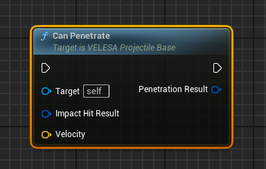
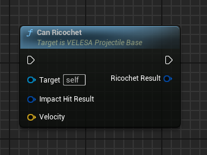
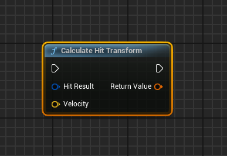
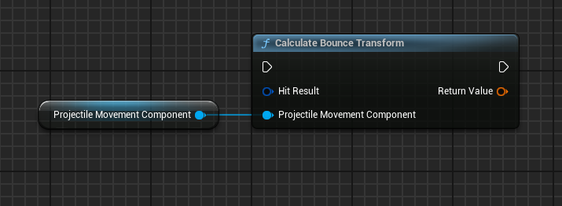
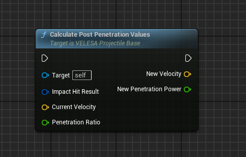

import {Step} from '@site/src/lib/utils.mdx'

## Can Penetrate

`Can Penetrate` checks if the projectile can penetrate a specific object by
calculating the penetration depth.

Properties that influence the penetration depth calculation:
- Projectile: Penetration Power
- Projectile: Velocity (on impact)
- Object Physical Material: Density
- Object Physical Material: Shear Strength

For objects to be penetrable, the object needs to have visible geometry on both
sides where a penetration can start (enter) and end (exit).
Objects without thickness, e.g. a simple plane model, should use a two-sided
Material (Shader).

* `Impact Hit Result` <Step text="1"/> : The hit result where the projectile
had hit before.
* `Velocity` <Step text="2"/> : The velocity of the projectile on hit.

Returns the `Penetration Result` <Step text="3"/> [data](/docs/projectile-module/types#ricochet-result) that was calculated.

## Can Ricochet

`Can Ricochet` checks if the projectile can ricochet (bounce) when impacting on
a specific object by calculating its ricochet chance. The chance depends on
the impact angle and Physical Material of the hit object.

* `Hit Result` <Step text="1"/> : The hit result where the projectile had
hit before.
* `Velocity` <Step text="2"/> : The velocity of the projectile on hit.

Returns the `Ricochet Result` <Step text="3"/> [data](/docs/projectile-module/types#ricochet-result) that was calculated.

## Calculate Hit Transform

`Calculate Hit Transform` calculates the transform that contains the impact
location and the rotation along the velocity direction.
If the velocity is nearly zero, the negated impact normal is used instead to
look towards the hit object.

* `Hit Result` <Step text="1"/> : The hit result of the projectile.
* `Velocity` <Step text="2"/> : The velocity of the projectile.

Returns the hit transform <Step text="3"/> of the projectile.

## Calculate Bounce Transform

`Calculate Bounce Transform` calculates the transformation that includes the
impact location and the rotation along the expected bounce velocity direction.
To determine the bounce velocity direction, we first simulate the velocity
limitation applied by the projectile movement component during a bounce.
Then, the velocity vector is negated and mirrored along the impact normal.

* `Hit Result` <Step text="1"/> : The hit result of the projectile.

Returns the bounce transform <Step text="2"/> of the projectile.

## Calculate Post Penetration Values

`Calculate Post Penetration Values` calculates the projectile's new velocity and
penetration power that should be set after a penetration was performed.
This function will be called by `PerformPenetration()` to apply post-penetration
modifications to the projectile.

* `Impact Hit Result` <Step text="1"/> : The projectile impact hit result.
* `Current Velocity` <Step text="2"/> : The projectile current velocity.
* `Penetration Ratio` <Step text="3"/> : The projectile penetration ratio.

Returns the `New Velocity` <Step text="4"/> that will be applied to the
projectile and the `New Penetration Power` <Step text="5"/> that will be applied
to the projectile.