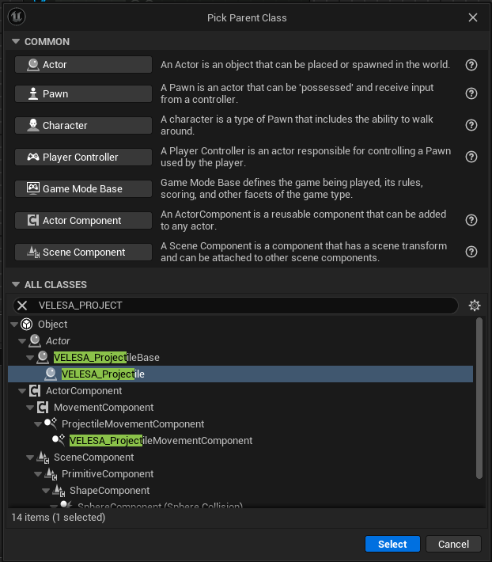
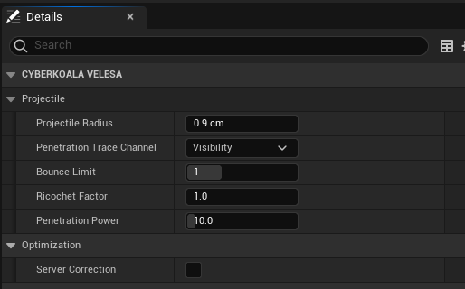
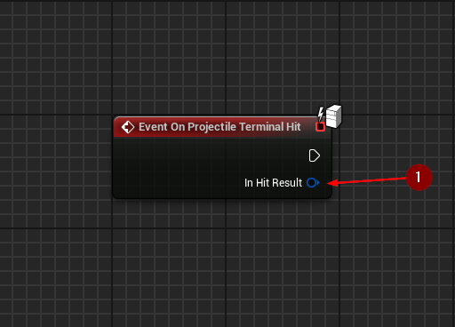
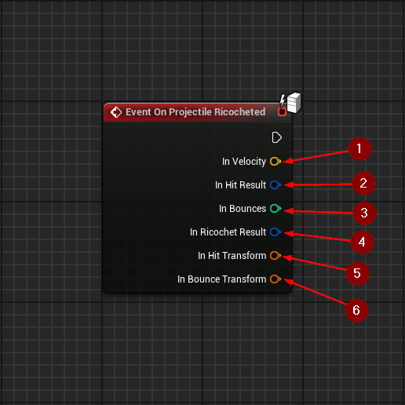
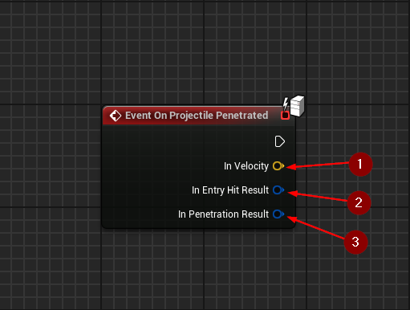

 

The `VELESA Projectile` actor has the ability to ricochet and penetrate objects
depending on the projectile's properties as well as the *Physical Material* of hit
objects if assigned.

## Projectile Settings

* `Projectile Radius` : Radius of the projectile.
* `Penetration Trace Channel` : Collision channel to use for projectile
penetration logic.
* `Bounce Limit` : How many bounces can the projectile make before being stopped.
* `Ricochet Factor` : Most-influencing factor for projectile ricochet chance.
Other factors affecting the ricochet chance are the properties of the *Physical
Material*.
* `Penetration Power` : How many centimeters of material of shear strength
(Default: 6) it can penetrate at a velocity of 10000.
* `Server Correction` : Set to true if proper rotation of the bullet is
important on multiplayer.

## Events

:::note
Keep in mind that those events will be called only on the server, so there is
no need for checking authority nor using RPCs.
:::

### On Projectile Terminal Hit

`On Projectile Terminal Hit` called when the projectile has come to a stop
(velocity is below simulation threshold, bounces are disabled, or it is forcibly
stopped).

* `Hit Result`  : The last hit result of the projectile.

### On Projectile Ricocheted

`On Projectile Ricocheted` called when the projectile has ricocheted (bounced).

* `Velocity` : The velocity of the projectile.
* `Hit Result` : The hit result of the projectile.
* `Bounces`  : The number of bounces that the projectile has
already made.
* `Ricochet Result`  : [The ricochet result](/docs/projectile-module/types#ricochet-result)
data the ricochet was based on.
* `Hit Transform`  : The calculated hit transform of the
projectile. See: [CalculateHitTransform()](/docs/projectile-module/projectile/functions#calculate-hit-transform).
* `Bounce Transform`  : The calculated bounce transform of the
projectile. See: [CalculateBounceTransform()](/docs/projectile-module/projectile/functions#calculate-bounce-transform).

### On Projectile Penetrated

`On Projectile Penetrated` called when the projectile has penetrated an object.

* `Velocity`   : The velocity of the projectile.
* `Entry Hit Result` : The hit result of the projectile on
entry.
* `Penetration Result` : [The penetration result](/docs/projectile-module/types#penetration-result)
data the penetration was based on.

