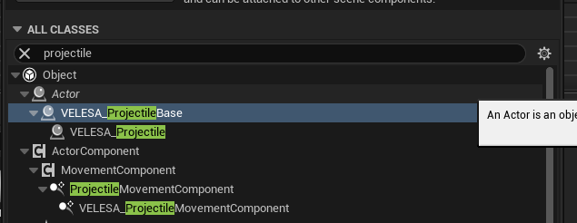
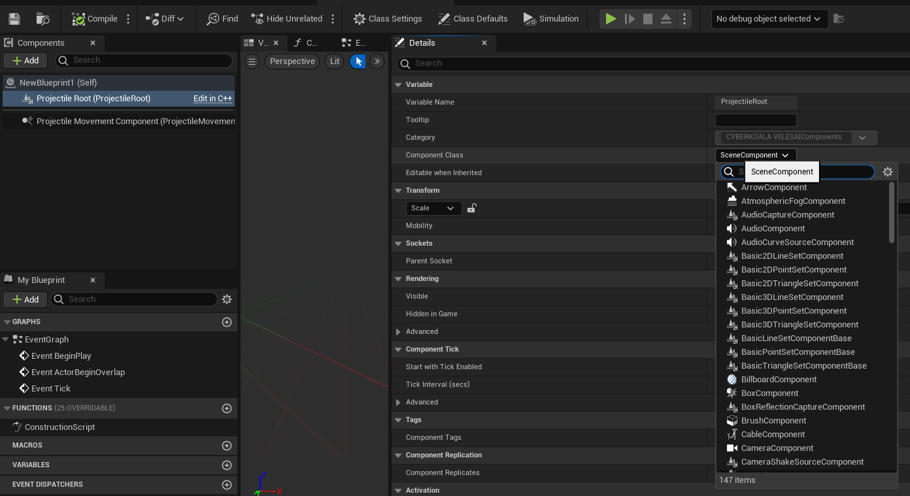

 

`VELESA Projectile Base` is the low-level class for implementing `VELESA Projectiles` and
using them with the `VELESA Projectile Launcher Component`.
It also extends the movement logic by using the `VELESA Projectile Movement Component`.

:::tip hint
Usually, what you are looking for is the `VELESA Projectile` [class](/docs/projectile-module/projectile/overview)
that will cover most cases unless your implementation requires to customize
the root component of this actor. So if you choose to use this class be mindful
about the required setup explained below.
:::

## Mandatory Setup

Ensure that you swap out the `Component Class` in the `ProjectileRoot` property
with a subclass of `UPrimitiveComponent`.

### Swap out component in C++
- Use the `ObjectInitializer` of the constructor.
- See `VELESA Projectile` for an example.

### Swap out component in Blueprints
- Open your child blueprint of `VELESA Projectile Base` and select the component
called `ProjectileRoot` .
- In the details panel, change the `Component Class` .

:::note
Only C++ subclasses are supported.
:::